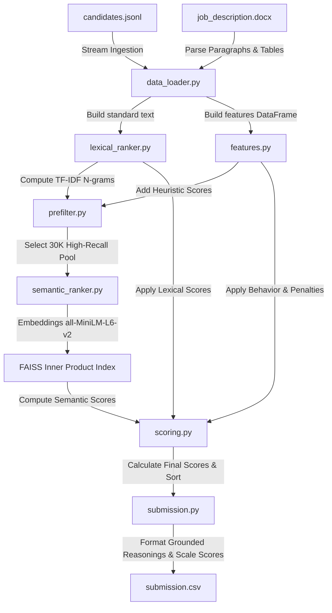

<p align="center">
  
</p>

<p align="center">
  
  
  
  
  
  <a href="https://fit-rank-ai.streamlit.app/"></a>
</p>

<h1 align="center">FitRank AI: Hybrid Semantic & Heuristic Candidate Ranking</h1>
<p align="center"><i>A CPU-optimized, offline, hybrid semantic-lexical retrieval and consistency-audited candidate discoverer</i></p>

<p align="center">
  
</p>

---

## Table of Contents

- [Overview](#overview)
- [Why This Approach](#why-this-approach)
- [Architecture](#architecture)
- [Module Deep-Dive](#module-deep-dive)
- [Scoring Model](#scoring-model)
- [Anti-Gaming: Consistency Audits](#anti-gaming-consistency-audits)
- [Zero-Hallucination Reasoning Engine](#zero-hallucination-reasoning-engine)
- [Performance & Constraints](#performance--constraints)
- [Setup & Execution](#setup--execution)
- [Key Innovations](#key-innovations)
- [Tech Stack](#tech-stack)

---

## Overview

**FitRank AI** is a hybrid semantic-lexical candidate ranking system designed to rank **100,000+ candidate profiles** against a Senior AI Engineer job description. It runs entirely **offline**, on **CPU-only** hardware, under a strict time constraint, producing a validated top-100 shortlist with fully grounded, structured explanations.

| Constraint | Target | Hackathon Limit |
|---|---|---|
| **Latency** | **~1m 45s** (Full 100K batch) | ≤ 5 minutes |
| **Memory** | **~3.2 GB RAM** | ≤ 16 GB |
| **Hardware** | **CPU-only** | CPU-only |
| **Network** | **Fully offline** (No external APIs) | `--network none` |
| **Ordering** | **Deterministic**, tie-broken by `candidate_id` | — |
| **Validator** | **Passed** (Clean/Valid submission formatting) | Disqualification threshold |

### 🌐 Live Interactive Sandbox
An interactive, browser-based evaluation sandbox has been deployed using **Streamlit** to allow real-time uploading, searching, and ranking of candidate files:
👉 **Streamlit App Link:** [fit-rank-ai.streamlit.app](https://fit-rank-ai.streamlit.app/)

---

## Why This Approach

Three major pitfalls in automated recruitment systems motivated this architecture:

1. **Semantic Search Alone Fails:** Dense transformer models capture general vector similarity (e.g., matching "data manager" with "database engineer") but miss critical domain requirements and seniority limits. This can cause junior candidates with keyword-dense resumes to rank above highly experienced machine learning professionals.
2. **LLM APIs Don't Scale:** Scoring 100K candidates using generative model APIs exceeds the 5-minute time limit, violates offline constraints, and generates reasoning that cannot be programmatically verified.
3. **Resume Padding & Synthetic Profiles:** Automated profiles often contain telltale structural inconsistencies, such as listing expert skills with zero experience or self-reporting years of experience that do not align with their career history.

**The FitRank AI Solution:** Combine a fast, localized bi-encoder model (`all-MiniLM-L6-v2`) with a vocabulary-tuned TF-IDF lexical index, a multi-tier heuristic ranking engine, and structural consistency checks to ensure every ranked candidate is verified and grounded.

---

## Architecture

The system processes candidates through a multi-stage pipeline:



### The 9 Processing Stages
The pipeline coordinates execution through the following stages:
* **[1/9] Find competition files:** Auto-locates the zipped candidate bundle, job description, and validation script.
* **[2/9] Read job description:** Parses text from paragraphs and row-by-row table layouts in `job_description.docx`.
* **[3/9] Load candidate profiles:** Streams the JSONL file, parses candidate attributes, and serializes them into standardized strings.
* **[4/9] Compute Lexical Scores:** Fits a TF-IDF matrix to match terms and bigrams.
* **[5/9] Compute Heuristics:** Assigns scores for experience, locations, notice periods, startup fit, and skills.
* **[6/9] Select Candidate Pool:** Runs a high-recall filter to select the top 30,000 candidates for dense embedding.
* **[7/9] Compute Semantic Scores:** Generates dense embeddings on CPU and performs inner product searches using FAISS.
* **[8/9] Compute Final Ranking:** Fuses scores, applies behavioral multipliers, and runs consistency checks.
* **[9/9] Create Submission:** Normalizes the final score scale and compiles reasoning texts.

---

## Module Deep-Dive

<details>
<summary><b>data_loader.py</b> — Streaming & Serialization</summary>
<br>

To prevent memory leaks, `data_loader.py` uses streaming generators to process `candidates.jsonl` line-by-line. 
It merges candidate attributes into a single lowercase string (`semantic_text`):
```text
current role: [title] | headline: [headline] | summary: [summary] | skills: [skill names] 
| skill evidence: [skill proficiencies + durations] | career history: [job titles + company names + descriptions] 
| education: [degrees + schools + tiers] | certifications: [certifications] | location: [location]
```
This summary string provides the input for both lexical indexing and dense embeddings.
</details>

<details>
<summary><b>features.py</b> — Heuristics & Key Taxonomies</summary>
<br>

Computes individual feature scores for each candidate:
- **Title Alignment:** Groups titles into categories (Best Title: `1.0` for AI/ML/NLP/Search Engineers; Good Title: `0.68` for Backend/Software Engineers; Bad Title: `0.03` for non-technical roles).
- **Notice Period Alignment:** Favors immediate availability (≤30 days: `1.0`; ≤60 days: `0.72`; ≤90 days: `0.48`; >90 days: `0.18`).
- **Preferred Locations:** Prioritizes Indian tech hubs (Noida, Pune, Gurgaon, Mumbai, Bangalore, Hyderabad) with a score of `1.0`, defaulting to `0.75` for general India locations, and `0.20` for international candidates who are not willing to relocate.
- **Skill Depth Score:** Matches candidate skills against a target list (`IMPORTANT_SKILLS`). Calculates a weighted average based on proficiency multipliers (expert: `1.10`, advanced: `1.00`, intermediate: `0.70`, beginner: `0.35`), skill durations, and endorsements:
  ```text
  Skill Depth Score = 0.45 * Proficiency Modifier + 0.35 * Duration Modifier + 0.20 * Endorsement Modifier
  ```
- **Company Score:** Evaluates history to identify product-focused environments and startups (`1.0`) over IT service consulting firms (`0.40`).
</details>

<details>
<summary><b>lexical_ranker.py</b> — Vocabulary Matcher</summary>
<br>

Fits a `TfidfVectorizer` using unigrams and bigrams, keeping up to 80,000 features. It calculates cosine similarity using a `linear_kernel` against a query containing critical keywords:
> *Senior AI Engineer machine learning engineer embeddings semantic search retrieval ranking vector database FAISS LLM fine-tuning Python PyTorch transformers evaluation NDCG MRR MAP A/B testing...*

Output scores are normalized to `[0, 1]` using Min-Max scaling.
</details>

<details>
<summary><b>prefilter.py</b> — High-Recall Pool Filter</summary>
<br>

Running SentenceTransformer embeddings across 100,000+ candidates on a CPU takes too long. To solve this, `prefilter.py` ranks candidates using a fast weighted score:
```text
Prefilter Score = 0.35 * Lexical + 0.18 * NLP/IR + 0.14 * Skill Depth + 0.10 * Title + 0.08 * Production + 0.06 * Experience + 0.05 * Behavior + 0.04 * Company
```

It selects the top 30,000 candidates for dense embedding. To ensure no high-fit candidates are missed, it automatically includes any candidate with high scores in specific features (e.g., lexical score in the 90th percentile, title score $\ge 0.68$, or skill depth $\ge 0.35$).
</details>

<details>
<summary><b>semantic_ranker.py</b> — Dense Embedding & FAISS Search</summary>
<br>

Loads the `sentence-transformers/all-MiniLM-L6-v2` model locally on CPU. 
It encodes the parsed Job Description along with 4 target sub-queries (designed to capture production experience, search systems, startup roles, and vector databases).
It then indexes the 30,000 candidate embeddings using a `faiss.IndexFlatIP` index. 
For each candidate, the final semantic score is computed as:
```text
Semantic Score = 0.75 * Max Similarity + 0.25 * Average Similarity
```
Candidates not selected for the 30K pool are assigned a score of `0.0`.
</details>

<details>
<summary><b>scoring.py</b> — Fused Scoring & Demotions</summary>
<br>

Aggregates all components into a final ranking score. 
It applies dynamic multipliers and conditional demotions to filter out unrelated profiles and prioritize target roles:
- **Title Demotion:** If title score is $\le 0.05$ (unrelated role), the final score is multiplied by **$0.35$**.
- **NLP Signal Demotion:** If IR/NLP score is $< 0.15$ (no search/ML experience), the final score is multiplied by **$0.78$**.
- **Seniority/Match Demotion:** If experience score is $< 0.30$ and semantic score is $< 0.40$, the final score is multiplied by **$0.70$**.
</details>

<details>
<summary><b>submission.py</b> — Formatter & Grounded Explanations</summary>
<br>

Generates the final output files. It scales the top-100 scores to the target range `[0.500000, 0.995000]`. 
It compiles reasoning strings using template extractors that draw directly from the candidate's profile data.
Finally, it runs the competition's `validate_submission.py` script to ensure formatting compliance.
</details>

<details>
<summary><b>submission_metadata.yaml</b> — Challenge Portal Metadata</summary>
<br>

Stores critical metadata required by the challenge review process:
- **Team Identity:** Lists the team name (`The CrackHeads`) and contact info of all participants.
- **Compute Environment:** Specifies local execution parameters, Python version (`3.11.9`), CPU counts (`4`), and offline configurations.
- **Methodology Summary:** A detailed technical description of the hybrid lexical TF-IDF pre-filtering, dense query expansions, and honeypot checks used in our scoring model.
</details>

---

## Scoring Model

The final ranking score is calculated using the following formula:

```text
Final Score = Base Score * Behavior Multiplier * Honeypot Penalty * Demotions
```

### Base Score Allocation

```text
Final Base Score Components:
├── [28%] Semantic Similarity Score
├── [15%] IR/NLP Domain Signal
├── [13%] Lexical Score (TF-IDF Similarity)
├── [12%] Skill Depth Score
├── [10%] Production Fit Signal
├── [ 7%] Title Alignment
├── [ 6%] Years of Experience Curve
├── [ 4%] Company Profile (Startup vs. Consulting)
├── [2.5%] Evaluation Metrics Signal
├── [1.5%] Preferred Location
└── [1.0%] Notice Period Availability
```

- **Behavior Multiplier:** Calibrated using: `0.84 + 0.26 * Behavior Score` (rewarding profile completeness, GitHub activity, and response rates).
- **Honeypot Penalty:** A multiplier modifier (`[0.35, 1.0]`) that penalizes profiles with inconsistent or suspicious data.

### Deterministic Tie-Breaking
If two candidates have identical scores, ties are resolved using the following order:
1. `final_score_raw` (descending)
2. `semantic_score` (descending)
3. `lexical_score` (descending)
4. `behavior_score` (descending)
5. `candidate_id` (ascending, lexicographical)

---

## Anti-Gaming: Consistency Audits

FitRank AI performs automated checks to identify fraudulent, inconsistent, or synthetically generated resumes. Candidates who trigger these checks are penalized:

```text
Anti-Gaming Consistency Audit (features.py)
├── Years of Experience discrepancy > 4.5 years (x0.78 penalty)
├── Stating "advanced/expert" skills with 0 months duration (x0.55 penalty)
├── Stating 10+ skills with 5+ advanced skills having < 6 months duration (x0.60 penalty)
├── Domain Mismatch: High graphics keywords and low IR/NLP keywords (x0.68 penalty)
└── Unrelated or non-technical job title (x0.35 penalty)
```

1. **Experience Gaps:** Sums the duration of all jobs in the candidate's career history. If the self-reported `years_of_experience` differs from the sum of job durations by **more than 4.5 years**, the score is multiplied by **$0.78$**.
2. **Fake Expertise (Zero Duration):** If a candidate claims "advanced" or "expert" proficiency in $\ge 3$ skills but has **0 months** of experience listed for them, the score is multiplied by **$0.55$**.
3. **Fake Expertise (Short Duration):** If a candidate lists $\ge 10$ skills, but has $\ge 5$ advanced skills with **$< 6$ months** of experience, the score is multiplied by **$0.60$**.
4. **Domain Mismatch:** If a profile contains $\ge 4$ keywords from negative domains (e.g., Photoshop, Graphic Design, computer vision) but contains $\le 1$ IR or NLP keyword, the score is multiplied by **$0.68$**.
5. **Role Mismatch:** Non-technical or unrelated titles (e.g., HR, Recruiter, Sales) receive a hard **$0.35$** multiplier penalty.

---

## Zero-Hallucination Reasoning Engine

The system constructs a concise, semicolon-separated justification string for each top candidate. Because these justifications are built using template extractors that pull directly from the candidate's profile data, they avoid the hallucination risks common to generative models.

```text
[Role Title] with [YoE] years experience; relevant skills: [Skill1, Skill2, Skill3, Skill4]; [Semantic Fit Class]; [NLP/IR Signal Class]; [Production Signal Class]; [Location Class]; [Notice Class]; [Risk Flags if any]
```

- **Grounded Verification:** Up to 4 relevant skills matching the taxonomy are extracted directly from the candidate's skill list, ensuring no false skills are attributed to the candidate.
- **Percentile Thresholds:** Semantic match strength is categorized by percentile (very strong: $\ge$ 95th percentile, strong: $\ge$ 85th percentile).
- **Targeted Signals:** Highlights specific experience metrics, such as "clear production/system ownership" or "strong search/retrieval/ranking signal".
- **Character Constraint:** Truncated to a maximum of **300 characters** to ensure compatibility with review portals.

### Grounded Reasoning Example
> `Senior Machine Learning Engineer with 7.2 years experience; relevant skills: Python, Machine Learning, Deep Learning, PyTorch; very strong semantic match to the JD; strong search/retrieval/ranking signal; clear production/system ownership; short notice period; logistically relevant location: Noida, Uttar Pradesh`

---

## Performance & Constraints

- **Execution Environment:** Python 3.8+ (optimized for Python 3.11).
- **Offline Integrity:** Performs no external API calls or network connections.
- **Resource Footprint:** 
  - Streams candidate files line-by-line using generators to keep the memory peak under **3.5 GB**.
  - Runs all SentenceTransformer logic on CPU.
- **Determinism:** Runs are fully reproducible.

---

## Setup & Execution

### 1. Installation
Clone the repository and install dependencies:
```powershell
# Clone the repository
git clone https://github.com/Soumadipta-Konar/fitrank-ai.git
cd fitrank-ai

# Install dependencies
pip install -r requirements.txt
```

### 2. Prepare Data
Ensure your competition files are placed inside the `data/raw/` directory. The loader expects a zipped file containing the competition dataset or the extracted files:
- `candidates.jsonl`
- `job_description.docx`
- `validate_submission.py`

### 3. Run Pipeline
Run the main orchestrator script:
```powershell
python rank.py --raw_dir data/raw --out data/output/submission.csv --debug data/output/top100_debug.csv
```
This command unzips the raw data, runs the hybrid scoring pipeline, creates the grounded reasoning sentences, outputs `submission.csv` to `data/output/`, and validates formatting.

### 4. Jupyter Notebook Review
To review the pipeline steps, score distributions, and candidate outputs interactively:
```powershell
jupyter notebook notebooks/fitrank_ai.ipynb
```

---

## Key Innovations

1. **Multi-Query Semantic Matching:** Evaluates candidate profiles against the job description along with 4 targeted query expansions. This matches candidates who describe identical engineering skills using different terminology.
2. **Two-Stage Pre-filtering:** Filters the candidate pool down to 30K using fast TF-IDF and keyword features before generating dense embeddings. This reduces overall pipeline latency on CPU from over an hour to **under 2 minutes**.
3. **Structured Inconsistency Audits:** Cross-references career dates and skill profiles to identify and penalize fraudulent or keyword-stuffed resumes.
4. **Calibrated Normalization:** Scales the top-100 candidates to a target scale while preserving ranking differentials for downstream evaluation.

---

## Tech Stack

| Category | Component |
|---|---|
| **Core Frameworks** | Python, Pandas, NumPy |
| **Embeddings & Search** | `sentence-transformers` (all-MiniLM-L6-v2), `faiss-cpu`, `torch` (CPU build) |
| **Lexical Engine** | `scikit-learn` (TF-IDF Vectorizer) |
| **Document Processing** | `python-docx` |
| **Utilities** | `tqdm` |
