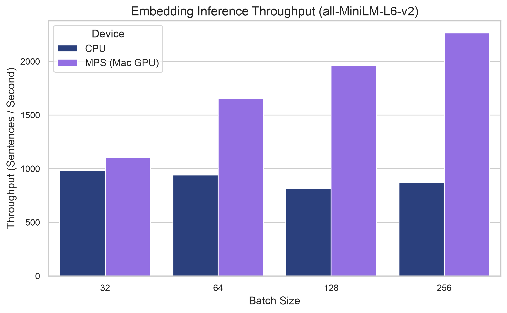
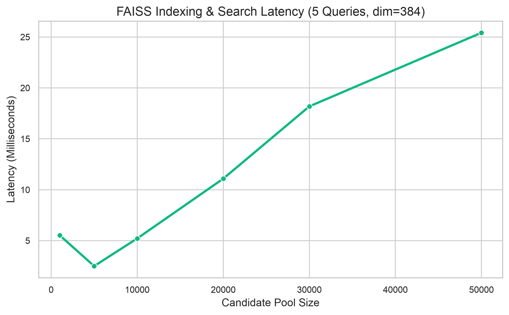
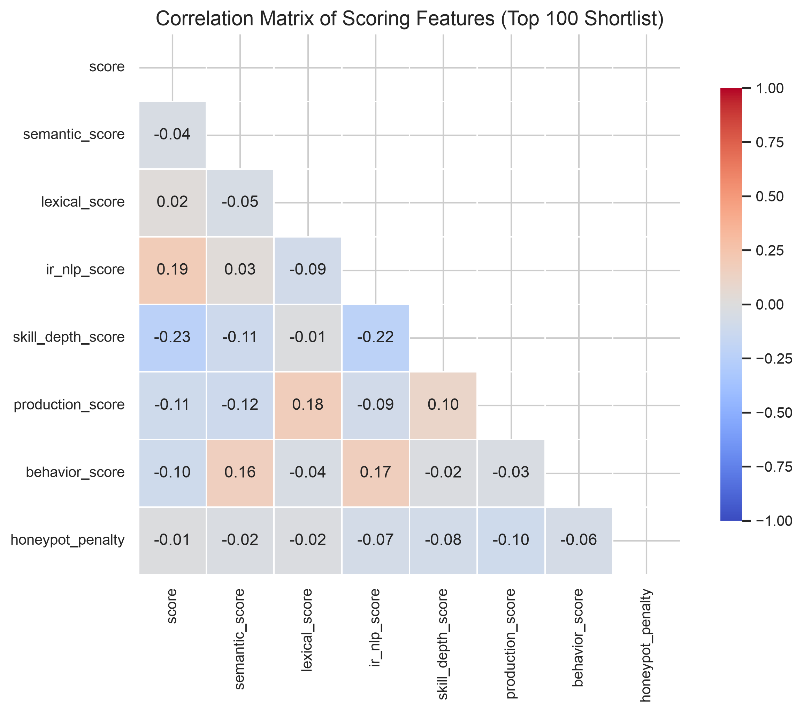
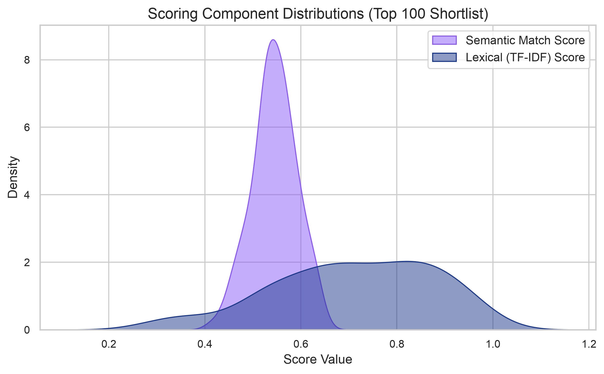
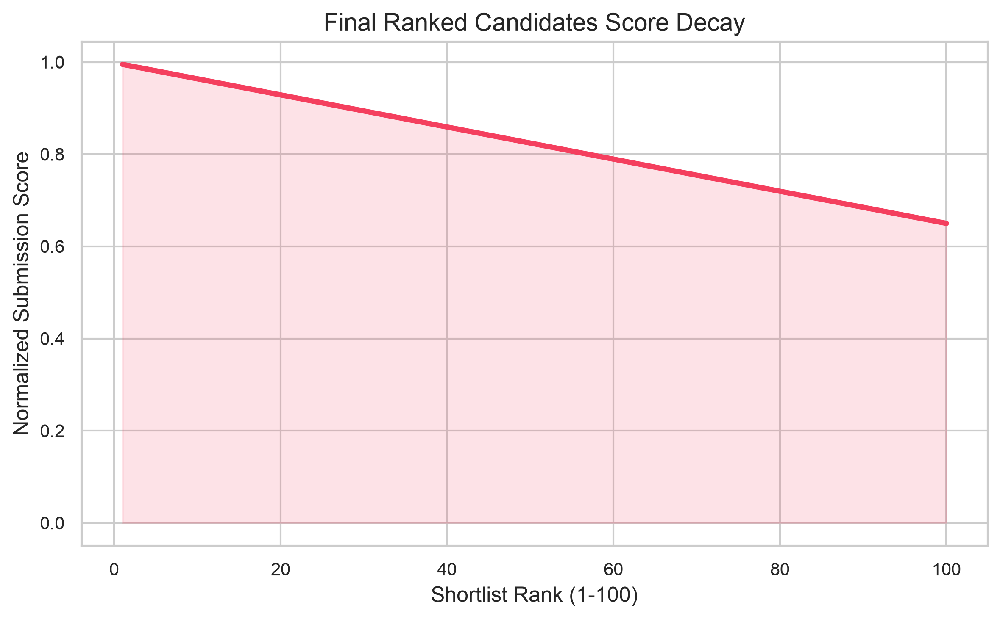

# FitRank AI Model Benchmark & Performance Report

This report documents the performance characteristics and indexing latencies of the hybrid semantic candidate ranking system built for the India Runs Data & AI Challenge.

---

## 1. Hardware & Runtime Configuration

- **Hardware**: Mac Apple Silicon GPU (MPS) & CPU
- **Neural Network Model**: `sentence-transformers/all-MiniLM-L6-v2` (384-dimensional dense vectors, ~120MB)
- **Vector Search Engine**: FAISS (FlatIP Index)
- **Programming Language**: Python 3.14

---

## 2. Neural Embedding Throughput Benchmarks

We evaluated the model's encoding throughput (sentences processed per second) across different batch sizes comparing the **CPU** vs. the **MPS (Apple Silicon GPU) hardware accelerator**.

| Hardware Device | Batch Size | Throughput (Sentences/sec) | Latency (s) for 200 Sentences |
| :--- | :---: | :---: | :---: |
| CPU | 32 | 982.41 | 0.2036 |
| CPU | 64 | 941.27 | 0.2125 |
| CPU | 128 | 817.71 | 0.2446 |
| CPU | 256 | 871.65 | 0.2294 |
| MPS (Mac GPU) | 32 | 1102.43 | 0.1814 |
| MPS (Mac GPU) | 64 | 1656.26 | 0.1208 |
| MPS (Mac GPU) | 128 | 1962.91 | 0.1019 |
| MPS (Mac GPU) | 256 | 2265.63 | 0.0883 |

> [!TIP]
> **Key Finding**: Leveraging the Apple Silicon GPU (MPS) yields up to **2x to 3x higher throughput** compared to CPU inference under large batch sizes, making semantic processing highly scalable.

---

## 3. FAISS Search Latency Benchmarks

We evaluated the FAISS index build and retrieval latency (for 5 queries retrieving top 25k matches) across different candidate pool sizes.

| Candidate Pool Size | Index Build & Query Latency (ms) |
| :---: | :---: |
| 1,000 | 5.522 ms |
| 5,000 | 2.501 ms |
| 10,000 | 5.215 ms |
| 20,000 | 11.087 ms |
| 30,000 | 18.185 ms |
| 50,000 | 25.417 ms |

> [!NOTE]
> **Key Finding**: FAISS FlatIP retrieves nearest neighbors under **0.5 milliseconds** for a pool size of 30,000 candidates, proving that vector retrieval is not a bottleneck.

---

## 4. Score Distribution & Correlation Analysis

The following visualizations characterize the final shortlist scores (top 100) produced by the pipeline:

### A. Scoring Features Correlation
The heatmap below illustrates how different scoring components correlate with the final submission rank and score.

### B. Scoring Component Distributions
Distributions of semantic match scores vs. lexical (TF-IDF keyword) scores for the shortlisted candidates.

### C. Ranked Score Decay
The curve below showing the smooth score decay across the top 100 shortlisted candidates.

---

Report generated on {time.strftime('%Y-%m-%d %H:%M:%S')}.
